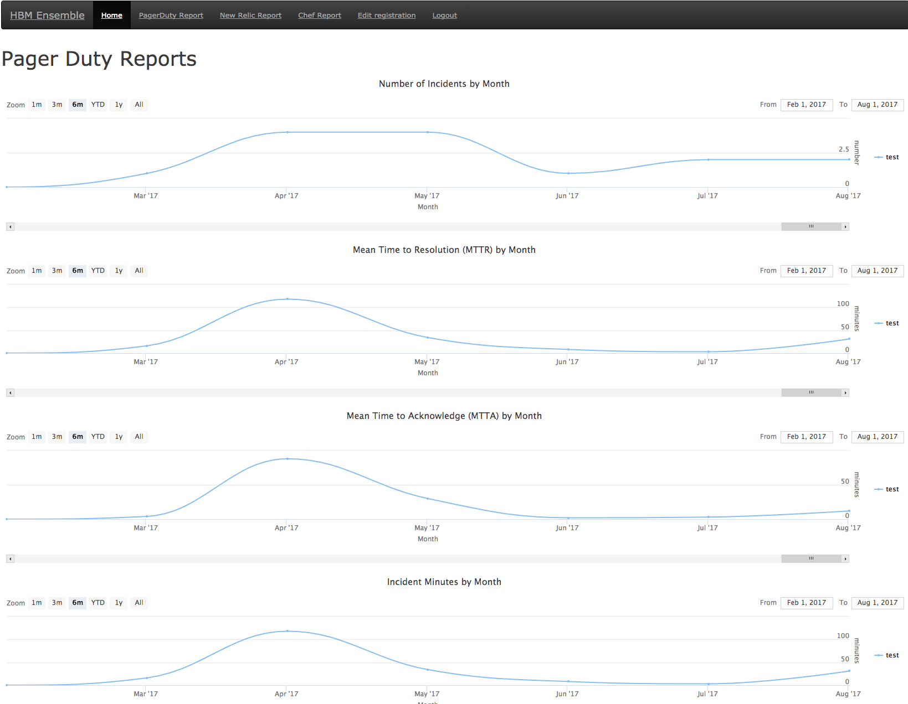
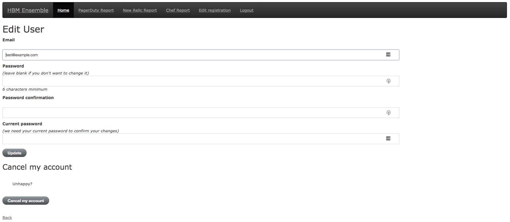
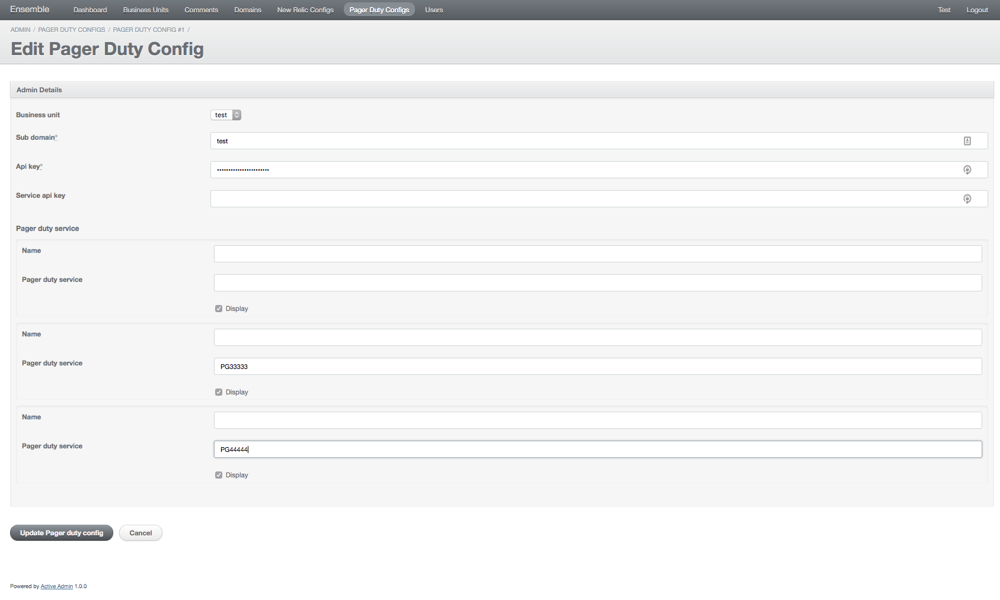

# ENSEMBLE

  

# Info
Ensemble is a multi-service/account data aggregator and dashboard provider

The following services are currently supported or in development
- Services:
  - Pagerduty (Beta)
  - New Relic (In Development)
  - Chef (Roadmap)
- Interface

# Table of Contents
<!-- TOC depthFrom:2 -->

- [Requirements](#requirements)
    - [Optional Requirements](#optional-requirements)
    - [More info](#more-info)
- [Quickstart](#quickstart)
- [Install](#install)
- [Usage](#usage)
    - [Administration](#administration)
- [Users](#users)
    - [Pagerduty](#pagerduty)
    - [Configuration](#configuration)
- [Development](#development)
- [Credits](#credits)
- [License](#license)

<!-- /TOC -->

## Requirements
- Ruby - Version 2.3+
- Database (Choose One):
  - Postgres (Recommended for Production; tested with 9.5 and 9.6)
  - sqlite (Recommended only for Testing/Development)
  
### Optional Requirements
- Docker
- Docker Compose

### More info
- Please see our [Wiki: Requirements](https://github.com/HearstAT/ensemble/wiki/Requirements) for More Info
## Quickstart
Fatest possible way to get your feet wet!
- Start by cloning this project
  - `git clone https://github.com/HearstAT/ensemble.git`
- Install Locally
  - `bundle install --binstubs --path vendor/bundle`
  - **Note**: There will be libraries required for Postgres and SQLite most likely that need to be installed for bundle install to succeed
- Run Quickstart Rake
  - `bundle exec rake quickstart:local`
## Install
- Please see our [Wiki: Install](https://github.com/HearstAT/ensemble/wiki/Install) for More Info
## Usage
- TODO
- Please see our [Wiki: Usage](https://github.com/HearstAT/ensemble/wiki/Usage) for Additional Info

### Administration
- Admin console is located under `/admin`, e.g. `localhost:3000/admin`
- Please see our [Wiki: Administration](https://github.com/HearstAT/ensemble/wiki/Usage#administration) for Additional Info
## Users

### Pagerduty

### Configuration
- TODO
- Please see our [Wiki: Configuration](https://github.com/HearstAT/ensemble/wiki/Usage#configuration) for Additional Info

## Development
- Please see our [Wiki: Development](https://github.com/HearstAT/ensemble/wiki/Development) for Development Options

## Credits

- [OS Ruby Gem](https://github.com/rdp/os) by Roger Pack (RDP). 
  - The gem is included as a helper library instead of in the Gemfile to create an easier installation process.

## License

Copyright 2017, Hearst Automation Team

Permission is hereby granted, free of charge, to any person obtaining a copy of this software and associated documentation files (the "Software"), to deal in the Software without restriction, including without limitation the rights to use, copy, modify, merge, publish, distribute, sublicense, and/or sell copies of the Software, and to permit persons to whom the Software is furnished to do so, subject to the following conditions:

The above copyright notice and this permission notice shall be included in all copies or substantial portions of the Software.

THE SOFTWARE IS PROVIDED "AS IS", WITHOUT WARRANTY OF ANY KIND, EXPRESS OR IMPLIED, INCLUDING BUT NOT LIMITED TO THE WARRANTIES OF MERCHANTABILITY, FITNESS FOR A PARTICULAR PURPOSE AND NONINFRINGEMENT. IN NO EVENT SHALL THE AUTHORS OR COPYRIGHT HOLDERS BE LIABLE FOR ANY CLAIM, DAMAGES OR OTHER LIABILITY, WHETHER IN AN ACTION OF CONTRACT, TORT OR OTHERWISE, ARISING FROM, OUT OF OR IN CONNECTION WITH THE SOFTWARE OR THE USE OR OTHER DEALINGS IN THE SOFTWARE.
